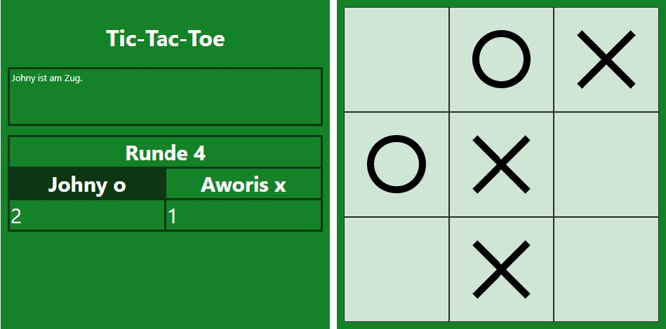

# Tic Tac Toe

Aufgabe war es, ein Spiel zu entwickeln, dass folgende Anforderungen erfüllt:

-   Erstelle ein Spielfeld mit 3x3 Feldern.

-   Es gibt zwei Spieler, die abwechselnd ihre Symbole "Kreuz" und "Kreis" in ein freies Feld setzen.

-   Der Spieler, der zuerst sein Symbol in drei Felder einer Zeile, Spalte oder Diagonalen setzen kann gewinnt. Andernfalls endet das Spiel unentschieden, sobald alle Felder mit einem Symbol belegt sind.

-   Das Programm ermöglicht es zwei Spielern unter Einhaltung der Spielregeln, gegeneinander anzutreten.

Das Programm wurde in JavaScript geschrieben.

## Spiel starten

Um das Spiel starten zu können, muss lediglich die Datei `index.html` mit einem Webbrowser geöffnet werden.

**Anmerkung:** Nicht mit allen Webbrowsern auf mobilen Geräten kann eine HTML-Datei geöffnet werden. Mit Webbrowsern auf Desktop-Geräten ist das Öffnen und Ausführen von HTML- und JavaScript-Deteien in der Regel möglich. Dieses Program wurde mit **Google Chrome Version 99.0.4844.51** getestet.

## Spielablauf

Das Spiel ist so ausgelegt, dass zwei Spieler auf dem selben Endgerät gegeneinander spielen.

Zug Beginn trägt der erste Spieler seinen Namen in das Eigabefeld ein, wählt sein Symbol aus (X oder O) und bestätigt anschließend mit einem Klick auf "Auswählen". Danach gibt der zweite Spieler seinen Namen ein und bestätigt ebenfalls mit einem Klick auf "Auswählen".

Das Spiel beginnt und beide Spieler können abwechselnd ihre Symbole in die Felder setzen, beginnend mit dem ersten Spieler. Sobald ein Gewinner ermittelt wurde, werden die entsprechenden Spielfelder farblich hervorgehoben, der Name des Gewinners wird im Textfeld angezeigt und der Punktestand wird aktualisiert.

Andernfalls endet das Spiel unentschieden, sobald alle Felder belegt sind. Ein entsprechender Text weist darauf hin.

## Neue Spielrunde starten

Sobald eine Spielrunde mit einem Gewinner oder mit Unentschieden endet, 
kann eine neue Runde gestartet werden. Hierzu erscheint eine Schaltfläche mit dem Text "Neue Runde".

 Der Punktestand bleibt mit jeder weiteren Runde erhalten und die Anzahl der gespielten Runden wird angezeigt. Mit jeder neuen Runde wechselt der Spieler, der das erste Symbol setzen darf.

## Neues Spiel starten

Um ein komplett neues Spiel zu starten, muss das Fenster des Webbrowser neu geladen werden. Anschließend können beide Spieler neue Namen vergeben und das Speil startet von vorn.
